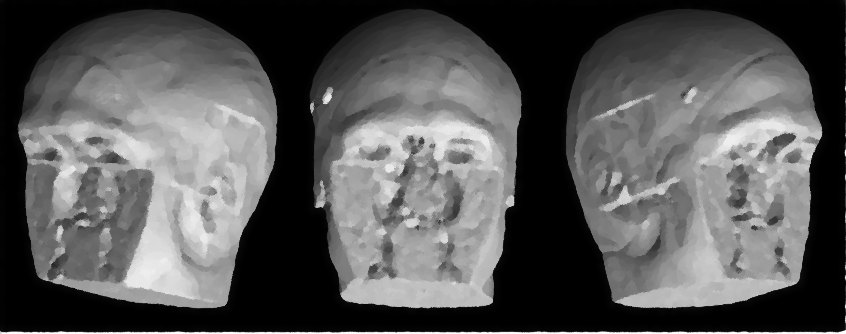

.. _defacing:

Defacing
========

Introduction
------------

Defacing MRI data is crucial for protecting participant privacy in
neuroimaging research. Structural brain MRI include facial features
that can be reconstructed and used to identify individuals. Defacing removes
these features while preserving brain anatomy for analysis.

The UK-Biobank imaging pipeline incorporates a customized
defacing workflow based on FSL :footcite:p:`almagro2018deface`. This workflow
is applied to T1-weighted (T1w) structural images and can be propagated to
other modalities through rigid alignement.

Requirements
------------

+------------+--------------+
| CPU        | RAM          |
+============+==============+
| 1          | 5 GB         |
+------------+--------------+

Description
-----------

**Processing Steps**

The defacing method used in the UK Biobank pipeline is provided as part of the
standard FSL distribution under the command ``fsl_deface``. Similar to other
established defacing tools—such as ``mri_deface`` :footcite:p:`bischoff2007deface`
and ``pydeface`` :footcite:p:`gulban2009deface`—the method relies on linear
registration to generate a mask that identifies facial voxels. Voxels within
this mask are then set to zero to remove identifiable facial features.

A key distinction of ``fsl_deface`` compared with ``mri_deface`` and
``pydeface`` is that it additionally removes the ears, providing a more
comprehensive anonymization of head anatomy.

**Quality Control**

A manual quality control step is performed using the generated
``defacemosaic`` figure, allowing visual inspection of the defaced image and
verification that facial structures have been successfully removed.

Outputs
-------

.. code-block:: text

    deface
    ├── dataset_description.json
    └── subjects
        └── sub-01
            └── ses-01
                ├── logs
                │   └── report_<timestamp>.rst
                ├── figures
                │   └── sub-01_ses-01_run-01_mod-T1w_defacemosaic.png
                ├── sub-01_ses-01_run-01_mod-T1w_defacemask.nii.gz 
                └── sub-01_ses-01_run-01_mod-T1w_deface.nii.gz

**Description of contents**:

- ``dataset_description.json``  
  Metadata describing the defacing dataset, including versioning and
  processing information.
- ``logs/report_<timestamp>.rst``  
  Contains workflow steps and parameters.
- ``sub-01_ses-01_run-01_mod-T1w_defacemask.nii.gz``  
  The binary mask identifying voxels removed during defacing (face and ears).
- ``sub-01_ses-01_run-01_mod-T1w_defacemosaic.png``  
  A visual mosaic showing before slices for quick quality assessment.
- ``sub-01_ses-01_run-01_mod-T1w_deface.nii.gz``  
  The final defaced T1w image with facial structures removed.

Featured examples
-----------------

.. grid::

  .. grid-item-card::
    :link: ../auto_examples/plot_defacing.html
    :link-type: url
    :columns: 12 12 12 12
    :class-card: sd-shadow-sm
    :margin: 2 2 auto auto

    .. grid::
      :gutter: 3
      :margin: 0
      :padding: 0

      .. grid-item::
        :columns: 12 4 4 4

        .. image:: ../auto_examples/images/thumb/sphx_glr_plot_defacing_thumb.png

      .. grid-item::
        :columns: 12 8 8 8

        .. div:: sd-font-weight-bold

          Defacing

        Explore how to perform this analysis with a container.

References
----------

.. footbibliography::
