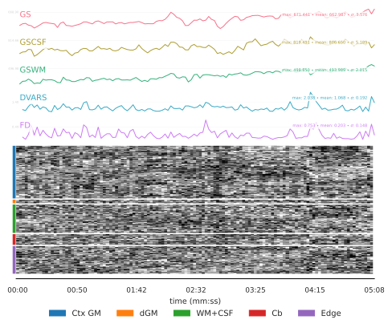

.. _fmriprep:

fMRI Pre-Processings
====================

Introduction
------------

Preprocessing of functional MRI (fMRI) data is a crucial step in transforming
raw scanner outputs into signals that can be meaningfully interpreted and
compared across individuals. Raw fMRI volumes contain a variety of
artifacts and sources of variability—such as head motion, scanner drift,
geometric distortions, and physiological noise—that can obscure the
underlying neural activity of interest. A standardized preprocessing
workflow addresses these issues by aligning images across time and space,
correcting for distortions, removing nuisance signals, and generating
anatomically and functionally consistent representations of the data.

Requirements
------------

+------------+--------------+
| CPU        | RAM          |
+============+==============+
| 1          | 10GB , 5 GB  |
+------------+--------------+

Description
-----------

**Processing Steps**

This analysis relies on fMRIPrep's pipeline :footcite:p:`esteban2019fmriprep`. 

- **Anatomical Data Preprocessing**
  The preprocessing relies on pre‑existing FreeSurfer reconstructions:
  fMRIPrep does not run or resume recon-all; instead, it uses the supplied
  surfaces and segmentations directly. The T1‑weighted image is processed
  through fMRIPrep's standard anatomical workflow, including bias‑field
  correction, skull stripping, brain tissues segmentation and spatial
  normalization to the MNI152NLin2009cAsym template. No MSM surface alignment
  is performed. Outputs are generated in both native T1w space and the
  MNI152NLin2009cAsym template space (both native resolution and 2 mm).

- **Functional Data Preprocessing**
  The preprocessing includes motion correction, susceptibility distortion
  correction using SyN (syn-sdc), and boundary‑based registration (bbr) to the
  anatomical image. Slice‑timing correction is explicitly disabled.
  Preprocessed BOLD data are resampled into the requested volumetric
  spaces: T1w space and the MNI152NLin2009cAsym template space (both native
  resolution and 2 mm).

- **Confounding factors**
  Several confounding time-series were calculated based on the preprocessed
  BOLD: framewise displacement (FD), DVARS and three region-wise global
  signals. FD was computed using two formulations(absolute sum of
  relative motions, relative root mean square displacement between affines).
  The three global signals are extracted within the CSF, the WM, and
  the whole-brain masks. Additionally, a set of physiological regressors were
  extracted to allow for component-based noise correction (CompCor).
  Principal components are estimated after high-pass filtering the
  preprocessed BOLD time-series (using a discrete cosine filter with 128s
  cut-off) for the two CompCor variants: temporal (tCompCor) and anatomical
  (aCompCor). tCompCor components are then calculated from the top 2% variable
  voxels within the brain mask. For aCompCor, three probabilistic masks
  (CSF, WM and combined CSF+WM) are generated in anatomical space. Finally,
  these masks are resampled into BOLD space.
  Components are also calculated separately within the WM and CSF masks. For
  each CompCor decomposition, the k components with the largest singular
  values are retained, such that the retained components' time series are
  sufficient to explain 50 percent of variance across the nuisance mask
  (CSF, WM, combined, or temporal).
  The head-motion estimates calculated in the correction step were also placed
  within the corresponding confounds file.
  The confound time series derived from head motion estimates and global
  signals  were expanded with the inclusion of temporal derivatives and
  quadratic terms for each.
  Additional nuisance timeseries are calculated by means of principal
  components analysis of the signal found within a thin band (crown)
  of voxels around the edge of the brain.

- **Surface Preprocessings**
  Surface-based preprocessing is enabled through the combination of
  Functional data are projected onto the subject's fsnative surfaces and then
  mapped to the fsLR surface space. CIFTI outputs at the 91k resolution are
  generating, producing dense time series suitable for surface-based analyses.
  Because MSM alignment is disabled, surface registration relies on the
  standard FreeSurfer‑to‑fsLR mapping.

- **Connectivity maps**
  Nilearn is used to extract ROI time series and compute functional
  connectivity based on the Schaefer 200 ROI atlas. It applies
  the Yeo preprocessing pipeline, including detrending, filtering, confound
  regression, and standardization. Connectivity is computed using Pearson
  correlation.
 
**Quality Control**:

- **Confounding scores**
  Images were classified as motion outliers when they exceeded established
  thresholds for head‑motion–related artifacts. Specifically, any volume with
  a mean framewise displacement greater than 0.2 mm, or with a mean
  standardized DVARS value exceeding 1.5, was flagged as low‑quality.

- **Manual inspection**  
  Subject‑level quality‑control HTML reports are reviewed manually to ensure
  that preprocessing outcomes are consistent across participants and that no
  systematic artifacts remain. 

- **Entropy score**
  The entropy score is thresholded at 12, such that images whose associated
  connectivity matrices do not exhibit meaningful structure are discarded.
  Accordingly, any image with an entropy greater than 12 is flagged as
  low-quality.

Outputs
-------

The ``fmriprep`` directory contains subject-level results, logs, and
quality-control outputs.
The structure is organized following the :ref:`brainprep ontology <ontology>`.

.. code-block:: text

    fmriprep/
    ├── dataset_description.json
    ├── figures
    │   ├── histogram_dvars_std.png
    │   └── histogram_fd_mean.png
    ├── log
    │   └── report_<timestamp>.rst
    ├── quality_check
    │   ├── motion_confounds.tsv
    │   └── network_entropy.tsv
    └── subjects
        ├── dataset_description.json
        ├── logs
        │   ├── CITATION.bib
        │   ├── CITATION.html
        │   ├── CITATION.md
        │   └── CITATION.tex
        ├── sub-01
        │   ├── figures
        │   └── ses-00
        │       ├── anat
        │       ├── figures
        │       │   ├── sub-01_ses-00_task-rest_run-01_space-MNI152NLin2009cAsym_atlas-schaefer200_desc-correlation_connectivity.png
        │       │   └── sub-01_ses-00_task-rest_run-01_space-MNI152NLin2009cAsym_atlas-schaefer200_desc-correlation_connectivity.tsv
        │       ├── func
        │       ├── log
        │       │   └── report_<timestamp>.rst
        │       └── workspace
        └── sub-01.html

**Description of contents**:

- ``dataset_description.json``  
  Metadata describing the process, including versioning and processing
  information.
- ``figures/histogram_dvars_std.png``  
  Histogram of mean standardized DVARS and applied threshold.
- ``figures/histogram_fd_mean.png``  
  Histogram of mean FD and applied threshold.
- ``log/report_<timestamp>.rst``  
  Contains group-level workflow steps and parameters.
- ``quality_check/motion_confounds.tsv``  
  Table containing the mean standardized DVARS and mean FD for each
  subject/session/run. The table includes a binary ``qc`` column indicating
  the quality control result.
- ``quality_check/network_entropy.tsv``  
  Table containing the connectivity matrix entropy for each
  subject/session/run. The table includes a binary ``qc`` column indicating
  the quality control result.
- ``subjects/dataset_description.json``  
  Metadata describing the process, including versioning and processing
  information.
- ``subjects/logs``  
  Text description of the process.
- ``subjects/sub-<id>/figures``  
  Standard fMRIPrep folder structure.
- ``subjects/sub-<id>/ses-<id>/anat``  
  Standard fMRIPrep folder structure.
- ``subjects/sub-<id>/ses-<id>/figures/*_space-MNI152NLin2009cAsym_atlas-schaefer200_desc-correlation_connectivity.png``  
  Display of the estimated connectivity matrix.
- ``subjects/sub-<id>/ses-<id>/figures/*_space-MNI152NLin2009cAsym_atlas-schaefer200_desc-correlation_connectivity.png``  
  Table containing the estimated connectivity matrix
- ``subjects/sub-<id>/ses-<id>/func``  
  Standard fMRIPrep folder structure.
- ``subjects/sub-<id>.html``  
  Standard fMRIPrep subject-level report.

Featured examples
-----------------

.. grid::

  .. grid-item-card::
    :link: ../auto_examples/plot_fmriprep.html
    :link-type: url
    :columns: 12 12 12 12
    :class-card: sd-shadow-sm
    :margin: 2 2 auto auto

    .. grid::
      :gutter: 3
      :margin: 0
      :padding: 0

      .. grid-item::
        :columns: 12 4 4 4

        .. image:: ../auto_examples/images/thumb/sphx_glr_plot_fmriprep_thumb.png

      .. grid-item::
        :columns: 12 8 8 8

        .. div:: sd-font-weight-bold

          fMRI Pre-Processing

        Explore how to perform this analysis.

References
----------

.. footbibliography::
