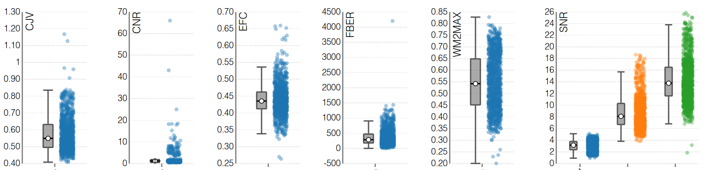

.. _quality_assurance:

Quality Assurance Workflow
==========================

Introduction
------------

Quality Assurance (QA) in MRI refers to the systematic evaluation of
data quality to ensure that the acquired images are suitable for
reliable scientific analysis. Because MRI data are susceptible to a wide
range of artifacts, such as motion, scanner drift, and physiological
noise, implementing QA procedures is essential for identifying issues that
could compromise downstream results. 

Requirements
------------

Running the workflow requires:

+------------+--------------+
| CPU        | RAM          |
+============+==============+
| 1          | 20 GB        |
+------------+--------------+

Description
-----------

**Processing Steps**

- **Image-quality metrics**
  MRIQC :footcite:p:`esteban2017mriqc` is used to automatically extract
  image-quality metrics (IQMs) from structural (T1w, T2w), functional
  (BOLD), and diffusion (EPI) MRI scans. Its purpose is to detect artifacts,
  inconsistencies, and outliers without requiring manual inspection of every
  image.

- **Feature selection**
  MRIQC computes a wide range of metrics, including signal-to-noise ratio (SNR),
  contrast-to-noise ratio (CNR), entropy focus criterion (EFC), and
  motion-related parameters, that help identify scans affected by motion,
  scanner instability, or acquisition errors.
  ... 

**Quality Control**

- **Manual inspection**  
  Group‑level quality‑control HTML reports are reviewed manually to ensure
  that preprocessing outcomes are consistent across participants and that no
  systematic artifacts remain.

Outputs
-------

The ``quality_assurance`` directory contains subject-level results,
group-level results, logs, and quality-control outputs.
The structure is organized following the :ref:`brainprep ontology <ontology>`.

.. code-block:: text

    quality_assurance/
    ├── dataset_description.json
    ├── group_bold.html
    ├── group_bold.tsv
    ├── group_dwi.html
    ├── group_dwi.tsv
    ├── group_T1w.html
    ├── group_T1w.tsv
    ├── logs
    │   └── report_<timestamp>.rst
    ├── sub-01
    │   └── ses-00
    │       ├── anat
    │       │   └── sub-01_ses-00_T1w.json
    │       ├── dwi
    │       │   └── sub-01_ses-00_dwi.json
    │       ├── func
    │       │   ├── sub-01_ses-00_task-ArchiStandard_dir-pa_bold.json
    │       │   ├── sub-01_ses-00_task-ArchiStandard_dir-pa_timeseries.json
    │       │   └── sub-01_ses-00_task-ArchiStandard_dir-pa_timeseries.tsv
    │       └── log
    │           └── report_<timestamp>.rst
    ├── sub-01_ses-00_dwi.html
    ├── sub-01_ses-00_T1w.html
    ├── sub-01_ses-00_task-ArchiStandard_dir-pa_bold.html
    ├── sub-02
    │   └── ses-00
    │       ├── anat
    │       │   └── sub-02_ses-00_T1w.json
    │       ├── dwi
    │       │   └── sub-02_ses-00_dwi.json
    │       ├── func
    │       │   ├── sub-02_ses-00_task-ArchiStandard_dir-pa_bold.json
    │       │   ├── sub-02_ses-00_task-ArchiStandard_dir-pa_timeseries.json
    │       │   └── sub-02_ses-00_task-ArchiStandard_dir-pa_timeseries.tsv
    │       └── log
    │           └── report_<timestamp>.rst
    ├── sub-02_ses-00_dwi.html
    ├── sub-02_ses-00_T1w.html
    └── sub-02_ses-00_task-ArchiStandard_dir-pa_bold.html

**Description of contents**:

- ``dataset_description.json``  
  Metadata describing the process, including versioning and processing
  information.
- ``group_*_<modality>.tsv``  
  Table with IQMs for each subject/session/run across all modalities.
- ``group_*_<modality>.html``  
  Standard MRIQC group-level report.
- ``log/report_<timestamp>.rst``  
  Contains group-level workflow steps and parameters.
- ``sub-<id>/ses-<id>``
  Standard MRIQC folder structure.
- ``sub-<id>_ses<id>_*_<modality>.html``  
  Standard MRIQC subject-level report.

Featured examples
-----------------

.. grid::

  .. grid-item-card::
    :link: ../auto_examples/workflows/plot_quality_assurance.html
    :link-type: url
    :columns: 12 12 12 12
    :class-card: sd-shadow-sm
    :margin: 2 2 auto auto

    .. grid::
      :gutter: 3
      :margin: 0
      :padding: 0

      .. grid-item::
        :columns: 12 4 4 4

        .. image:: ../auto_examples/workflows/images/thumb/sphx_glr_plot_quality_assurance_thumb.png

      .. grid-item::
        :columns: 12 8 8 8

        .. div:: sd-font-weight-bold

          Quality Assurance

        Explore how to perform this analysis.

References
----------

.. footbibliography::
