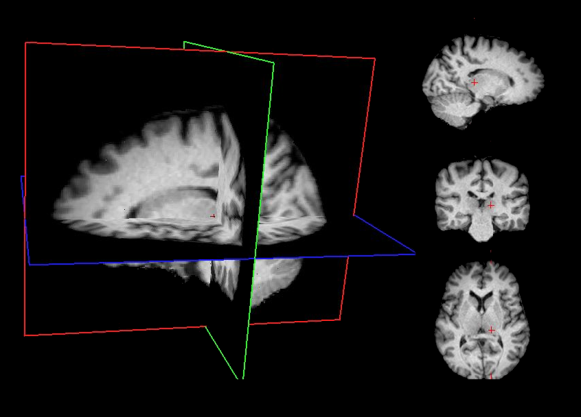

.. _quasiraw:

Quasi RAW
=========

   

Introduction
------------

Minimally preprocessed data are generated using a standardized sequence of
lightweight processing steps applied to the raw T1-weighted (T1w) MRI images.
This workflow combines skull stripping, bias field correction, and spatial
normalization using widely adopted neuroimaging tools. This minimal
preprocessing pipeline ensures that the data are standardized and
ready for subsequent processing stages while maintaining maximal fidelity to
the original raw images.

Requirements
------------

+------------+--------------+
| CPU        | RAM          |
+============+==============+
| 1          | 5 GB         |
+------------+--------------+

Description
-----------

**Processing Steps**

- **Skull stripping**  
  Brain extraction is performed using FreeSurfer's deep learning–based
  ``mri_synthstrip`` method :footcite:p:`hoopes2022brainmask`, which provides a
  robust and accurate removal of non-brain tissues.

- **Bias field correction**  
  Intensity non-uniformities are corrected using the ANTs N4 algorithm
  :footcite:p:`avants2009ants`, improving image homogeneity and preparing the
  data for downstream analysis.

- **Affine registration to MNI space**  
  Spatial alignment is carried out using FSL FLIRT
  :footcite:p:`jenkinson2001flirt` with a 9‑degree‑of‑freedom (DOF) affine
  transformation (translations, rotations, and scaling; no shearing). This step
  registers the T1w image to the MNI template while preserving overall anatomy.

**Quality Control**

- **Correlation-based sorting**  
   For each image, we compute its correlation with the mean of all other
   images in the dataset. Images are then sorted in ascending order of this
   correlation score, allowing potential outliers to be easily identified.

- **Manual inspection**  
   Following the correlation-based ranking, images at the lower end of the
   distribution are manually reviewed in-house. A preliminary threshold is
   applied to remove the most obvious outliers.

- **Thresholding**  
   For the remaining images, we compute the average pairwise correlation after
   registration, using Fisher’s z-transform to stabilize variance. Only images
   with an average correlation greater than 0.5 are retained for further
   processing.

Outputs
-------

The ``quasiraw`` directory contains the minimally processed T1-weighted (T1w)
MRI data, along with logs, quality-control outputs, and subject-level results.
The structure is organized to ensure transparency, reproducibility, and easy
navigation across subjects and sessions.

.. code-block:: text

    quasiraw
    ├── dataset_description.json
    ├── logs
    │   └── report_<timestamp>.rst
    ├── figures
    │   ├── histogram_mean_correlation.png
    │   └── pca.png
    ├── qc
    │   ├── mean_correlations.tsv
    │   └── pca.tsv
    └── subjects
       └── sub-01
           └── ses-01
               ├── logs
               │   └── report_<timestamp>.rst
               ├── sub-01_ses-01_run-01_mod-T1w_affine.txt
               ├── sub-01_ses-01_run-01_mod-T1w_brainmask.nii.gz
               └── sub-01_ses-01_run-01_T1w.nii.gz

**Description of contents**:

- ``dataset_description.json``  
  Metadata describing the defacing dataset, including versioning and
  processing information.
- ``logs/report_<timestamp>.rst``  
  Contains group-level workflow steps and parameters.
- ``histogram_mean_correlation.png`` 
  Histogram of mean inter-image correlations used to detect outliers.
- ``pca.png``  
  PCA projection of images for visual inspection.
- ``mean_correlations.tsv`` 
  Tabulated mean correlation values (after Fisher z-transform), used to
  identify low-quality images. A QC column is included to flag which images
  pass the sanity check, allowing quick identification of valid and invalid
  entries.
- ``pca.tsv`` 
  Numerical PCA components corresponding to the ``pca.png`` visualization.
- ``/sub-01/ses-01/logs/report_<timestamp>.rst``  
  Contains subject-level workflow steps and parameters.
- ``sub-01_ses-01_run-01_mod-T1w_affine.txt`` 
  Affine transformation parameters (9 DOF) used to align the T1w image to
  the MNI template.
- ``sub-01_ses-01_run-01_mod-T1w_brainmask.nii.gz``
  Brain mask generated during skull stripping (e.g., via SynthStrip).
- ``sub-01_ses-01_run-01_T1w.nii.gz``
  The minimally preprocessed T1w image, including skull stripping, bias
  correction, and affine alignment.

Featured examples
-----------------

.. grid::

  .. grid-item-card::
    :link: ../auto_examples/plot_quasiraw.html
    :link-type: url
    :columns: 12 12 12 12
    :class-card: sd-shadow-sm
    :margin: 2 2 auto auto

    .. grid::
      :gutter: 3
      :margin: 0
      :padding: 0

      .. grid-item::
        :columns: 12 4 4 4

        .. image:: ../auto_examples/images/thumb/sphx_glr_plot_quasiraw_thumb.png

      .. grid-item::
        :columns: 12 8 8 8

        .. div:: sd-font-weight-bold

          Quasi RAW

        Explore how to perform this analysis with a container.

References
----------

.. footbibliography::
