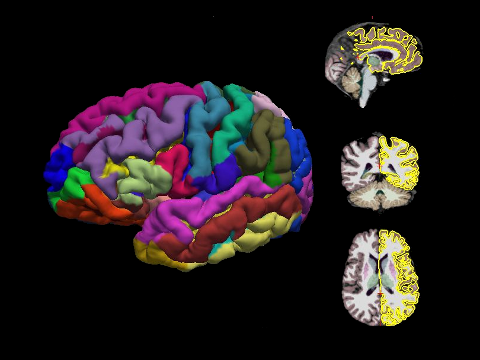

.. _sbm:

Brain parcellation
==================

Introduction
------------

The brain parcellation process takes raw T1‑weighted MRI scans as input and
produces segmented brain volumes, cortical surface models, parcellation
maps, and a wide range of quantitative metrics (e.g., cortical thickness,
surface area, etc.).

The workflow supports both cross‑sectional preprocessing and longitudinal
refinement of brain MRI data. In the cross‑sectional setting, each timepoint
is processed independently, ensuring consistent treatment of individual
scans. For longitudinal studies, the workflow provides dedicated routines
that refine results across multiple timepoints from the same subject. By
leveraging temporal consistency, it improves segmentation accuracy, reduces
measurement variability, and enhances the reliability of derived metrics
such as cortical thickness or volume change. This approach is particularly
valuable for investigating brain development, aging trajectories, and disease
progression.

Requirements
------------

+------------+--------------+
| CPU        | RAM          |
+============+==============+
| 1          | 16 GB, 64 GB |
+------------+--------------+

Running the workflow requires a CPU with **AVX** or **AVX2** support  
You can check this with::

    lscpu | grep -i avx

Description
-----------

**Processing Steps**

- **Cortical analysis**
  Cortical analysis relies on FreeSurfer's recon‑all pipeline
  :footcite:p:`fischl2012freesurfer`. The analysis
  stream includes intensity normalization, skull stripping, segmentation of
  GM (pial) and WM, hemispheric-based tessellations, topology corrections and
  inflation, and registration to the *fsaverage* template.

- **ROI-based morphological measures**
  ROI-based morphological measures are extracted on both the Desikan
  :footcite:p:`desikan2006automated` and Destrieux
  :footcite:p:`fischl2004automatically` parcellations, including seven
  ROI‑based features: mean and standard deviation of cortical thickness,
  gray‑matter volume, surface area, integrated mean and Gaussian curvatures,
  and the intrinsic curvature index.

- **Vertex-wise morphological measures**
  Vertex‑wise features - cortical thickness, curvature, and average convexity
  - are computed on the high‑resolution seventh‑order icosahedral mesh,
  providing fine‑grained surface information :footcite:p:`fischl1999cortical`.
  To support inter‑hemispheric surface‑based analyses, right‑hemisphere
  features are mapped onto the left hemisphere using the symmetric
  fsaverage_sym template and the xhemi routines :footcite:p:`greve2013surface`.

**Quality Control**

We first perform a visual inspection of the images ranked according to their
correlation score. In addition, we use the Euler number as an image‑quality
metric and retain only those with a value greater than −217, following the
recommendation of :footcite:p:`rosen2018`.

Outputs
-------

The ``brain_parcellation`` directory contains the minimally processed T1-weighted (T1w)
MRI data, along with logs, quality-control outputs, and subject-level results.
The structure is organized to ensure transparency, reproducibility, and easy
navigation across subjects and sessions.

.. code-block:: text

    brain_parcellation
    ├── dataset_description.json
    ├── figures
    │   └── histogram_euler_number.png
    ├── logs
    │   └── report_<timestamp>.rst
    ├── longitudinal
    │   ├── figures
    │   │   └── histogram_euler_number.png
    │   ├── morphometry
    │   │   ├── aparc2009s_ses-study1_hemi-lh_meas-area_stats.csv
    │   │   ├── aparc2009s_ses-study1_hemi-lh_meas-curvind_stats.csv
    │   │   ├── aparc2009s_ses-study1_hemi-lh_meas-foldind_stats.csv
    │   │   ├── aparc2009s_ses-study1_hemi-lh_meas-gauscurv_stats.csv
    │   │   ├── aparc2009s_ses-study1_hemi-lh_meas-meancurv_stats.csv
    │   │   ├── aparc2009s_ses-study1_hemi-lh_meas-thickness_stats.csv
    │   │   ├── aparc2009s_ses-study1_hemi-lh_meas-thicknessstd_stats.csv
    │   │   ├── aparc2009s_ses-study1_hemi-lh_meas-volume_stats.csv
    │   │   ├── aparc2009s_ses-study1_hemi-rh_meas-area_stats.csv
    │   │   ├── aparc2009s_ses-study1_hemi-rh_meas-curvind_stats.csv
    │   │   ├── aparc2009s_ses-study1_hemi-rh_meas-foldind_stats.csv
    │   │   ├── aparc2009s_ses-study1_hemi-rh_meas-gauscurv_stats.csv
    │   │   ├── aparc2009s_ses-study1_hemi-rh_meas-meancurv_stats.csv
    │   │   ├── aparc2009s_ses-study1_hemi-rh_meas-thickness_stats.csv
    │   │   ├── aparc2009s_ses-study1_hemi-rh_meas-thicknessstd_stats.csv
    │   │   ├── aparc2009s_ses-study1_hemi-rh_meas-volume_stats.csv
    │   │   ├── aparc2009s_ses-study2_hemi-lh_meas-area_stats.csv
    │   │   ├── aparc2009s_ses-study2_hemi-lh_meas-curvind_stats.csv
    │   │   ├── aparc2009s_ses-study2_hemi-lh_meas-foldind_stats.csv
    │   │   ├── aparc2009s_ses-study2_hemi-lh_meas-gauscurv_stats.csv
    │   │   ├── aparc2009s_ses-study2_hemi-lh_meas-meancurv_stats.csv
    │   │   ├── aparc2009s_ses-study2_hemi-lh_meas-thickness_stats.csv
    │   │   ├── aparc2009s_ses-study2_hemi-lh_meas-thicknessstd_stats.csv
    │   │   ├── aparc2009s_ses-study2_hemi-lh_meas-volume_stats.csv
    │   │   ├── aparc2009s_ses-study2_hemi-rh_meas-area_stats.csv
    │   │   ├── aparc2009s_ses-study2_hemi-rh_meas-curvind_stats.csv
    │   │   ├── aparc2009s_ses-study2_hemi-rh_meas-foldind_stats.csv
    │   │   ├── aparc2009s_ses-study2_hemi-rh_meas-gauscurv_stats.csv
    │   │   ├── aparc2009s_ses-study2_hemi-rh_meas-meancurv_stats.csv
    │   │   ├── aparc2009s_ses-study2_hemi-rh_meas-thickness_stats.csv
    │   │   ├── aparc2009s_ses-study2_hemi-rh_meas-thicknessstd_stats.csv
    │   │   ├── aparc2009s_ses-study2_hemi-rh_meas-volume_stats.csv
    │   │   ├── aparc_ses-study1_hemi-lh_meas-area_stats.csv
    │   │   ├── aparc_ses-study1_hemi-lh_meas-curvind_stats.csv
    │   │   ├── aparc_ses-study1_hemi-lh_meas-foldind_stats.csv
    │   │   ├── aparc_ses-study1_hemi-lh_meas-gauscurv_stats.csv
    │   │   ├── aparc_ses-study1_hemi-lh_meas-meancurv_stats.csv
    │   │   ├── aparc_ses-study1_hemi-lh_meas-thickness_stats.csv
    │   │   ├── aparc_ses-study1_hemi-lh_meas-thicknessstd_stats.csv
    │   │   ├── aparc_ses-study1_hemi-lh_meas-volume_stats.csv
    │   │   ├── aparc_ses-study1_hemi-rh_meas-area_stats.csv
    │   │   ├── aparc_ses-study1_hemi-rh_meas-curvind_stats.csv
    │   │   ├── aparc_ses-study1_hemi-rh_meas-foldind_stats.csv
    │   │   ├── aparc_ses-study1_hemi-rh_meas-gauscurv_stats.csv
    │   │   ├── aparc_ses-study1_hemi-rh_meas-meancurv_stats.csv
    │   │   ├── aparc_ses-study1_hemi-rh_meas-thickness_stats.csv
    │   │   ├── aparc_ses-study1_hemi-rh_meas-thicknessstd_stats.csv
    │   │   ├── aparc_ses-study1_hemi-rh_meas-volume_stats.csv
    │   │   ├── aparc_ses-study2_hemi-lh_meas-area_stats.csv
    │   │   ├── aparc_ses-study2_hemi-lh_meas-curvind_stats.csv
    │   │   ├── aparc_ses-study2_hemi-lh_meas-foldind_stats.csv
    │   │   ├── aparc_ses-study2_hemi-lh_meas-gauscurv_stats.csv
    │   │   ├── aparc_ses-study2_hemi-lh_meas-meancurv_stats.csv
    │   │   ├── aparc_ses-study2_hemi-lh_meas-thickness_stats.csv
    │   │   ├── aparc_ses-study2_hemi-lh_meas-thicknessstd_stats.csv
    │   │   ├── aparc_ses-study2_hemi-lh_meas-volume_stats.csv
    │   │   ├── aparc_ses-study2_hemi-rh_meas-area_stats.csv
    │   │   ├── aparc_ses-study2_hemi-rh_meas-curvind_stats.csv
    │   │   ├── aparc_ses-study2_hemi-rh_meas-foldind_stats.csv
    │   │   ├── aparc_ses-study2_hemi-rh_meas-gauscurv_stats.csv
    │   │   ├── aparc_ses-study2_hemi-rh_meas-meancurv_stats.csv
    │   │   ├── aparc_ses-study2_hemi-rh_meas-thickness_stats.csv
    │   │   ├── aparc_ses-study2_hemi-rh_meas-thicknessstd_stats.csv
    │   │   ├── aparc_ses-study2_hemi-rh_meas-volume_stats.csv
    │   │   ├── aseg_ses-study1_stats.csv
    │   │   └── aseg_ses-study2_stats.csv
    │   ├── qc
    │   │   └── euler_numbers.tsv
    │   └── subjects
    │       └── sub-02
    │           ├── logs
    │           │   └── report_<timestamp>.rst
    │           ├── ses-study1
    │           │   └── run-01
    │           │       ├── label
    │           │       ├── mri
    │           │       ├── scripts
    │           │       ├── stats
    │           │       ├── surf
    │           │       ├── tmp
    │           │       ├── touch
    │           │       └── trash
    │           ├── ses-study2
    │           │   └── run-01
    │           │       ├── label
    │           │       ├── mri
    │           │       ├── scripts
    │           │       ├── stats
    │           │       ├── surf
    │           │       ├── tmp
    │           │       ├── touch
    │           │       └── trash
    │           └── template
    │               ├── base-tps
    │               ├── label
    │               ├── mri
    │               ├── scripts
    │               ├── stats
    │               ├── surf
    │               ├── tmp
    │               ├── touch
    │               └── trash
    ├── morphometry
    │   ├── aparc2009s_ses-study1_hemi-lh_meas-area_stats.csv
    │   ├── aparc2009s_ses-study1_hemi-lh_meas-curvind_stats.csv
    │   ├── aparc2009s_ses-study1_hemi-lh_meas-foldind_stats.csv
    │   ├── aparc2009s_ses-study1_hemi-lh_meas-gauscurv_stats.csv
    │   ├── aparc2009s_ses-study1_hemi-lh_meas-meancurv_stats.csv
    │   ├── aparc2009s_ses-study1_hemi-lh_meas-thickness_stats.csv
    │   ├── aparc2009s_ses-study1_hemi-lh_meas-thicknessstd_stats.csv
    │   ├── aparc2009s_ses-study1_hemi-lh_meas-volume_stats.csv
    │   ├── aparc2009s_ses-study1_hemi-rh_meas-area_stats.csv
    │   ├── aparc2009s_ses-study1_hemi-rh_meas-curvind_stats.csv
    │   ├── aparc2009s_ses-study1_hemi-rh_meas-foldind_stats.csv
    │   ├── aparc2009s_ses-study1_hemi-rh_meas-gauscurv_stats.csv
    │   ├── aparc2009s_ses-study1_hemi-rh_meas-meancurv_stats.csv
    │   ├── aparc2009s_ses-study1_hemi-rh_meas-thickness_stats.csv
    │   ├── aparc2009s_ses-study1_hemi-rh_meas-thicknessstd_stats.csv
    │   ├── aparc2009s_ses-study1_hemi-rh_meas-volume_stats.csv
    │   ├── aparc2009s_ses-study2_hemi-lh_meas-area_stats.csv
    │   ├── aparc2009s_ses-study2_hemi-lh_meas-curvind_stats.csv
    │   ├── aparc2009s_ses-study2_hemi-lh_meas-foldind_stats.csv
    │   ├── aparc2009s_ses-study2_hemi-lh_meas-gauscurv_stats.csv
    │   ├── aparc2009s_ses-study2_hemi-lh_meas-meancurv_stats.csv
    │   ├── aparc2009s_ses-study2_hemi-lh_meas-thickness_stats.csv
    │   ├── aparc2009s_ses-study2_hemi-lh_meas-thicknessstd_stats.csv
    │   ├── aparc2009s_ses-study2_hemi-lh_meas-volume_stats.csv
    │   ├── aparc2009s_ses-study2_hemi-rh_meas-area_stats.csv
    │   ├── aparc2009s_ses-study2_hemi-rh_meas-curvind_stats.csv
    │   ├── aparc2009s_ses-study2_hemi-rh_meas-foldind_stats.csv
    │   ├── aparc2009s_ses-study2_hemi-rh_meas-gauscurv_stats.csv
    │   ├── aparc2009s_ses-study2_hemi-rh_meas-meancurv_stats.csv
    │   ├── aparc2009s_ses-study2_hemi-rh_meas-thickness_stats.csv
    │   ├── aparc2009s_ses-study2_hemi-rh_meas-thicknessstd_stats.csv
    │   ├── aparc2009s_ses-study2_hemi-rh_meas-volume_stats.csv
    │   ├── aparc_ses-study1_hemi-lh_meas-area_stats.csv
    │   ├── aparc_ses-study1_hemi-lh_meas-curvind_stats.csv
    │   ├── aparc_ses-study1_hemi-lh_meas-foldind_stats.csv
    │   ├── aparc_ses-study1_hemi-lh_meas-gauscurv_stats.csv
    │   ├── aparc_ses-study1_hemi-lh_meas-meancurv_stats.csv
    │   ├── aparc_ses-study1_hemi-lh_meas-thickness_stats.csv
    │   ├── aparc_ses-study1_hemi-lh_meas-thicknessstd_stats.csv
    │   ├── aparc_ses-study1_hemi-lh_meas-volume_stats.csv
    │   ├── aparc_ses-study1_hemi-rh_meas-area_stats.csv
    │   ├── aparc_ses-study1_hemi-rh_meas-curvind_stats.csv
    │   ├── aparc_ses-study1_hemi-rh_meas-foldind_stats.csv
    │   ├── aparc_ses-study1_hemi-rh_meas-gauscurv_stats.csv
    │   ├── aparc_ses-study1_hemi-rh_meas-meancurv_stats.csv
    │   ├── aparc_ses-study1_hemi-rh_meas-thickness_stats.csv
    │   ├── aparc_ses-study1_hemi-rh_meas-thicknessstd_stats.csv
    │   ├── aparc_ses-study1_hemi-rh_meas-volume_stats.csv
    │   ├── aparc_ses-study2_hemi-lh_meas-area_stats.csv
    │   ├── aparc_ses-study2_hemi-lh_meas-curvind_stats.csv
    │   ├── aparc_ses-study2_hemi-lh_meas-foldind_stats.csv
    │   ├── aparc_ses-study2_hemi-lh_meas-gauscurv_stats.csv
    │   ├── aparc_ses-study2_hemi-lh_meas-meancurv_stats.csv
    │   ├── aparc_ses-study2_hemi-lh_meas-thickness_stats.csv
    │   ├── aparc_ses-study2_hemi-lh_meas-thicknessstd_stats.csv
    │   ├── aparc_ses-study2_hemi-lh_meas-volume_stats.csv
    │   ├── aparc_ses-study2_hemi-rh_meas-area_stats.csv
    │   ├── aparc_ses-study2_hemi-rh_meas-curvind_stats.csv
    │   ├── aparc_ses-study2_hemi-rh_meas-foldind_stats.csv
    │   ├── aparc_ses-study2_hemi-rh_meas-gauscurv_stats.csv
    │   ├── aparc_ses-study2_hemi-rh_meas-meancurv_stats.csv
    │   ├── aparc_ses-study2_hemi-rh_meas-thickness_stats.csv
    │   ├── aparc_ses-study2_hemi-rh_meas-thicknessstd_stats.csv
    │   ├── aparc_ses-study2_hemi-rh_meas-volume_stats.csv
    │   ├── aseg_ses-study1_stats.csv
    │   └── aseg_ses-study2_stats.csv
    ├── qc
    │   └── euler_numbers.tsv
    └── subjects
        └── sub-01
            ├── ses-study1
            │   ├── figures
            │   │   └── sub-01_ses-study1_run-01_brainparc.png
            │   ├── logs
            │   │   ├── report_<timestamp>.rst
            │   ├── run-01
            │   │   ├── label
            │   │   ├── mri
            │   │   ├── nextbrain
            │   │   ├── scripts
            │   │   ├── stats
            │   │   ├── surf
            │   │   ├── tmp
            │   │   ├── touch
            │   │   ├── trash
            │   │   └── xhemi
            └── ses-study2
                ├── figures
                │   └── sub-01_ses-study2_run-01_brainparc.png
                ├── logs
                │   └── report_<timestamp>.rst
                └── run-01
                    ├── label
                    ├── mri
                    ├── nextbrain
                    ├── scripts
                    ├── stats
                    ├── surf
                    ├── tmp
                    ├── touch
                    ├── trash
                    └── xhemi

**Description of contents**:

- ``dataset_description.json``  
  Metadata describing the defacing dataset, including versioning and
  processing information.
- ``figures/histogram_euler_number.png``
  Histogram of Euler numbers across subjects, used to detect surface
  reconstruction failures or topological defects.
- ``logs/report_<timestamp>.rst``  
  Contains group-level workflow steps and parameters.
- ``longitudinal/figures/histogram_euler_number.png``
  Euler number histogram computed specifically for longitudinal sessions.
- ``longitudinal/morphometry``
  Contains regional morphometric statistics derived from FreeSurfer
  parcellations. Each CSV file corresponds to a specific parcellation
  scheme (e.g., ``aparc``, ``aparc2009s``), hemisphere (``hemi-lh`` or
  ``hemi-rh``), session (``ses-study1``, ``ses-study2``), and measurement type
  (cortical area, curvature indices, cortical thickness, cortical volume).
  Additionally, contains volumetric segmentation statistics for subcortical
  structures (``aseg_ses-study1_stats.csv``, ``aseg_ses-study2_stats.csv``).
- ``longitudinal/qc/euler_numbers.tsv``  
  Tabulated Euler numbers for each subject and session, used to identify
  surface reconstruction issues.
- ``longitudinal/subjects/sub-<id>/logs/report_<timestamp>.rst``
  Subject-level workflow report.
- ``longitudinal/subjects/sub-<id>/ses-<id>/run-<id>``
  Standard FreeSurfer folder structure.
- ``longitudinal/subjects/sub-02/template/``
  The ``template`` directory contains the longitudinal FreeSurfer template
  built across sessions.
- ``qc/euler_numbers.tsv``  
  Tabulated Euler numbers for each subject and session, used to identify
  surface reconstruction issues.
- ``subjects/sub-<id>/ses-<id>/run-<id>``
  Standard FreeSurfer folder structure.

Featured examples
-----------------

.. grid::

  .. grid-item-card::
    :link: ../auto_examples/plot_brain_parcellation.html
    :link-type: url
    :columns: 12 12 12 12
    :class-card: sd-shadow-sm
    :margin: 2 2 auto auto

    .. grid::
      :gutter: 3
      :margin: 0
      :padding: 0

      .. grid-item::
        :columns: 12 4 4 4

        .. image:: ../auto_examples/images/thumb/sphx_glr_plot_brain_parcellation_thumb.png

      .. grid-item::
        :columns: 12 8 8 8

        .. div:: sd-font-weight-bold

          Brain Parcellation

        Explore how to perform this analysis with a container.

References
----------

.. footbibliography::
