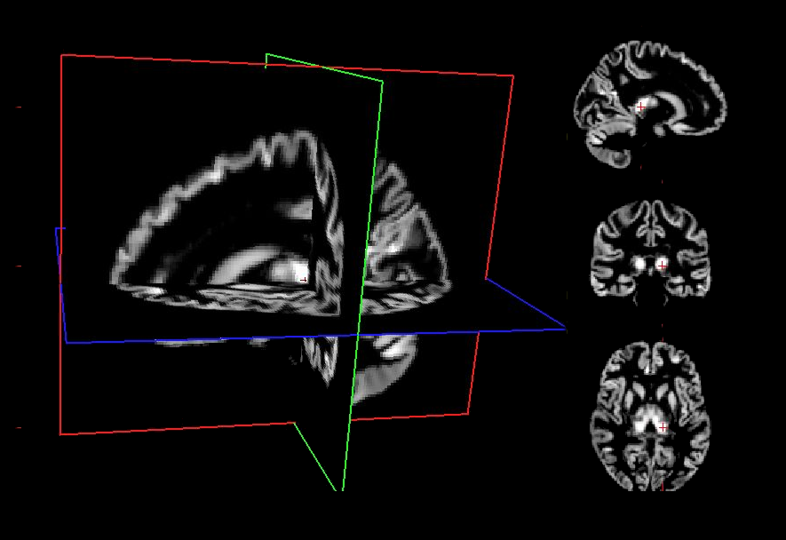

.. _vbm:

Voxel Based Morphometry
=======================

Introduction
------------

Voxel-Based Morphometry (VBM) is a widely used neuroimaging technique for
assessing structural differences in brain anatomy across individuals or
groups. It provides an automated, whole‑brain approach to quantifying
regional gray matter (GM), white matter (WM), and cerebrospinal fluid (CSF)
volumes from T1-weighted MRI scans. Unlike manual or
region‑of‑interest methods, VBM does not require predefined anatomical
boundaries, making it particularly well suited for exploratory analyses and
large-scale studies.

Requirements
------------

+------------+--------------+
| CPU        | RAM          |
+============+==============+
| 1          | 5 GB         |
+------------+--------------+

Description
-----------

**Processing Steps**

- **Initial Image Preparation**
  CAT12 :footcite:p:`gaser2024cat12vbm` applies several preparatory steps to
  improve image quality and prepare the data for segmentation: bias-field
  correction, affine registration to MNI space, and noise and intensity
  normalization to improve tissue contrast and reduce local intensity
  variations.

- **Tissue Segmentation**
  CAT12 :footcite:p:`gaser2024cat12vbm` performs an advanced segmentation of
  the brain into gray matter (GM), white matter (WM), and cerebrospinal fluid
  (CSF). The tool performs: adaptive local segmentation (LAS) for improved
  boundary detection, graph-cut refinement to sharpen tissue borders,
  partial volume estimation to model voxels containing mixed tissue types,
  white matter hyperintensity correction, and Markov Random Field smoothing to
  reduce isolated misclassifications.

- **Spatial Normalization**
  The segmented tissues are registered to a DARTEL template. Both forward and
  inverse deformation fields are saved. These allow transforming data between
  native and template space.

- **Modulation**
  To preserve local tissue volumes after spatial normalization, CAT12 applies
  modulation to the GM, WM, and CSF maps. This step ensures that voxel values
  reflect regional volume rather than concentration.

- **Resampling**
  All normalized images are resampled to 1.5 mm isotropic resolution.

- **ROI-Based Morphometry**
  Regional measures are extracted using a comprehensive set of atlases,
  including: Neuromorphometrics, LPBA40, Hammers, AAL3, Julich Brain,
  COBRA, Schaefer 100/200/400/600 parcels, Mori white‑matter atlas,
  Anatomy toolbox. For each atlas, CAT12 computes regional volumes.

**Longitudinal Processing Steps**

- **Intra‑subject realignment**
  All time points for a participant are rigidly aligned to each other to
  remove differences caused by head position rather than true anatomical
  change.

- **Creation of an unbiased within‑subject template**
  CAT12 builds a subject‑specific anatomical template by averaging all time
  points in a way that does not favor any single session. This template
  serves as a stable reference for all subsequent processing.

- **Bias correction and intensity normalization**
  Each time point is corrected for intensity inhomogeneity and normalized
  relative to the subject‑specific template, reducing session‑to‑session
  variability.

- **Longitudinal segmentation**
  GM, WM, and CSF are segmented using priors derived from the subject‑specific
  template. This improves tissue classification consistency across time points.

- **Longitudinal DARTEL registration**
  All time points are nonlinearly registered to the subject‑specific template,
  then to the group template. This two‑stage approach increases sensitivity
  to subtle structural changes.

- **Modulation**
  To preserve local tissue volumes after spatial normalization, CAT12 applies
  modulation to the GM, WM, and CSF maps. This step ensures that voxel values
  reflect regional volume rather than concentration.

- **Resampling**
  All normalized images are resampled to 1.5 mm isotropic resolution.

**Quality Control**:

- **Correlation score**  
  For each image, we compute its correlation with the DARTEL template. Images
  are then sorted in ascending order of this score, allowing potential
  outliers to be easily identified.

- **Manual inspection**  
  Following the correlation-based ranking, ``T1w`` images at the
  lower end of the distribution are manually reviewed in-house.

- **Thresholding**  
  Both Noise Contrast Ratio (NCR) and Image Quality Rating (IQR) are
  thresholded at a minimum value of 4. Images with NCR < 4 or IQR < 4 are
  flagged as low‑quality.

Outputs
-------

The ``vbm`` directory contains subject-level results, longitudinal results,
group-level results, logs, and quality-control outputs.
The structure is organized following the :ref:`brainprep ontology <ontology>`.

.. code-block:: text

    vbm/
    ├── dataset_description.json
    ├── logs
    │   └── report_<timestamp>.rst
    ...

**Description of contents**:

- ``dataset_description.json``  
  Metadata describing the process, including versioning and processing
  information.
- ``log/report_<timestamp>.rst``  
  Contains group-level workflow steps and parameters.
- ...

Featured examples
-----------------

.. grid::

  .. grid-item-card::
    :link: ../auto_examples/plot_vbm.html
    :link-type: url
    :columns: 12 12 12 12
    :class-card: sd-shadow-sm
    :margin: 2 2 auto auto

    .. grid::
      :gutter: 3
      :margin: 0
      :padding: 0

      .. grid-item::
        :columns: 12 4 4 4

        .. image:: ../auto_examples/images/thumb/sphx_glr_plot_vbm_thumb.png

      .. grid-item::
        :columns: 12 8 8 8

        .. div:: sd-font-weight-bold

          VBM

        Explore how to perform this analysis.

References
----------

.. footbibliography::
